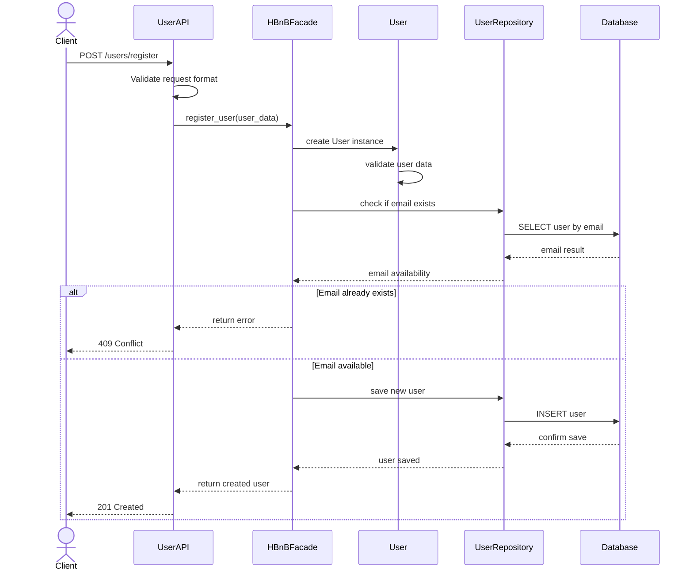
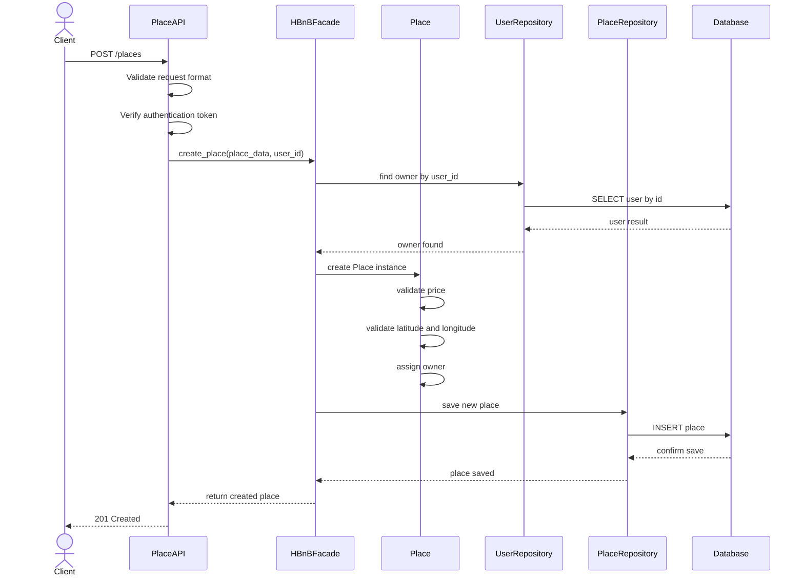
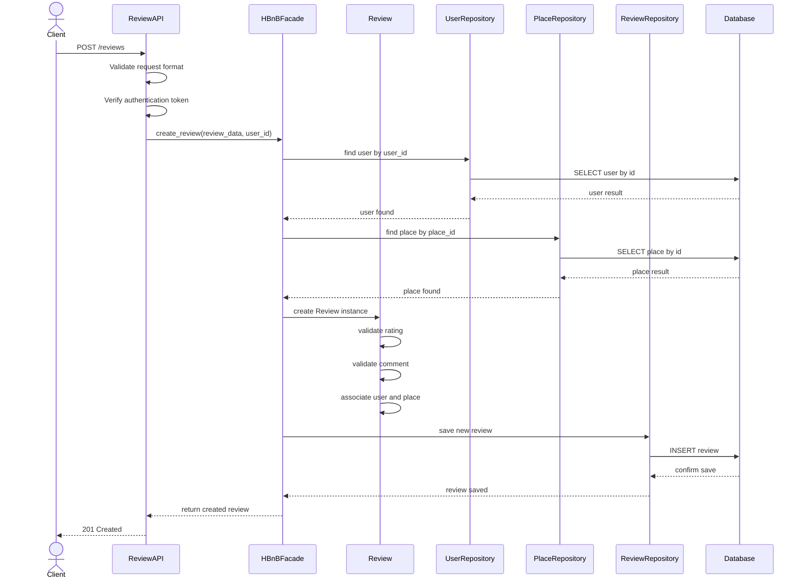
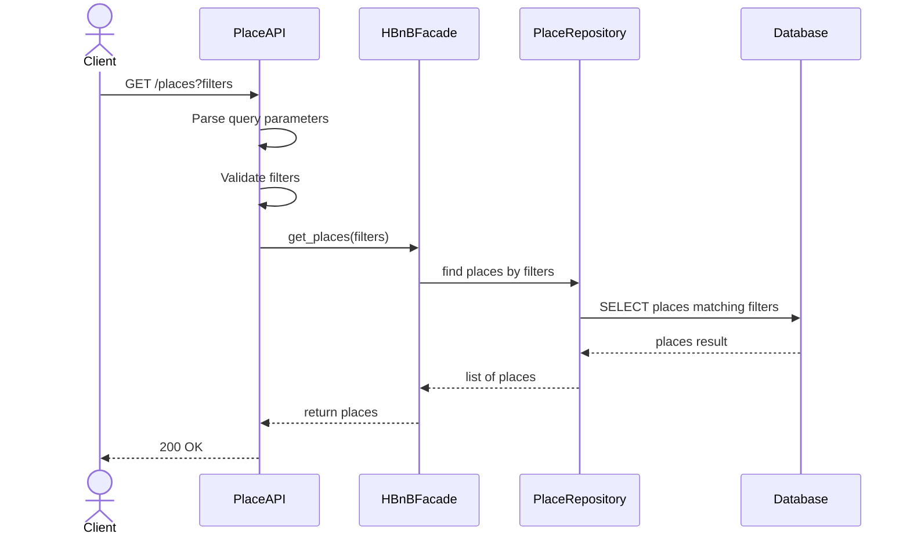

# Sequence Diagrams for API Calls

## Objective

The objective of this task is to create sequence diagrams for four important API calls in the HBnB Evolution application.

The diagrams show how the different layers of the system interact when handling a request:

- Presentation Layer
- Business Logic Layer
- Persistence Layer

The four API calls represented are:

1. User Registration
2. Place Creation
3. Review Submission
4. Fetching a List of Places

---

# 1. User Registration

## Description

This sequence diagram shows the process of registering a new user in HBNB.

A client sends user information to the API. The request is passed down to the facade, which coordinates the creation of the new user. The business logic validates the data and sends it to the persistence layer to be stored.

## Sequence Diagram



## Flow Explanation

1. The client sends a registration request to the `UserAPI`.
2. The `UserAPI` validates the request.
3. The request is sent to the `HBnBFacade`.
4. The facade creates a `User` object and applies business validation.
5. The persistence layer checks whether the email already exists.
6. If the email exists, the system is going to return an error.
7. If the email is available, the new user is going to be saved.
8. The API returns a success response to the client.

---

# 2. Place Creation

## Description

This sequence diagram shows the process of creating a new place listing.

An authenticated user sends place information to the API. The facade coordinates the creation of the place, associates it with the owner, validates the data, and gets stored in the persistence layer.

## Sequence Diagram



## Flow Explanation

1. The client sends the request to create a place.
2. The `PlaceAPI` validates the request and verifies authentication.
3. The request is sent to the `HBnBFacade`.
4. The facade retrieves the user who will own the place.
5. A `Place` instance is created.
6. The place data is validated, including price and location.
7. The place is saved using the `PlaceRepository`.
8. The API returns a success response.

---

# 3. Review Submission

## Description

This sequence diagram shows how a user submits a review for a place.

The API receives the review request and sends it to the facade. The facade checks that the user and place exist, creates the review, validates the rating and comment, and stores the review in the persistence layer.

## Sequence Diagram



## Flow Explanation

1. The client submits a review request.
2. The `ReviewAPI` validates the request and verifies authentication.
3. The request is sent to the `HBnBFacade`.
4. The facade retrieves the user submitting the review.
5. The facade retrieves the place being reviewed.
6. A `Review` instance is created.
7. The rating and comment are validated.
8. The review is associated with the user and place.
9. The review is saved.
10. The API returns a success response.

---

# 4. Fetching a List of Places

## Description

This sequence diagram shows how a client requests a list of places.

The API receives optional search criteria, such as price or location filters. The facade forwards the request to the persistence layer, which retrieves the matching places from the database.

## Sequence Diagram



## Flow Explanation

1. The client sends a request to fetch places.
2. The `PlaceAPI` parses and validates the query parameters.
3. The request is sent to the `HBnBFacade`.
4. The facade asks the `PlaceRepository` to retrieve matching places.
5. The repository queries the database.
6. The database returns the matching records.
7. The list of places is returned to the API.
8. The API responds to the client with the results.

---

# Design Notes

These sequence diagrams follow the layered architecture defined in the package diagram.

The general flow is:

```text
Client
  ↓
Presentation Layer
  ↓
HBnBFacade
  ↓
Business Models
  ↓
Persistence Layer
  ↓
Database
```

The `HBnBFacade` is used as the central interface between the Presentation Layer and the Business Logic Layer. This keeps the API layer separated from the internal business models and persistence logic.

The diagrams also show how each request follows a clear sequence:

1. The API receives the request.
2. The request is validated.
3. The facade coordinates the business operation.
4. The business model applies the required logic.
5. The persistence layer stores or retrieves data.
6. A response is returned to the client.

---

# Conclusion

This file provides four sequence diagrams that describe important workflow of the API's in the HBnB application.

The diagrams cover:

- User registration
- Place creation
- Review submission
- Fetching a list of places

These diagrams help explain how the Presentation Layer, Business Logic Layer, and Persistence Layer interact with each other to process API requests.
