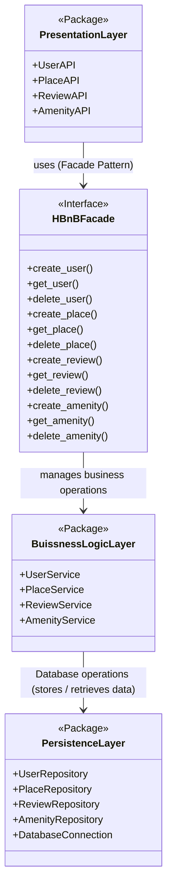
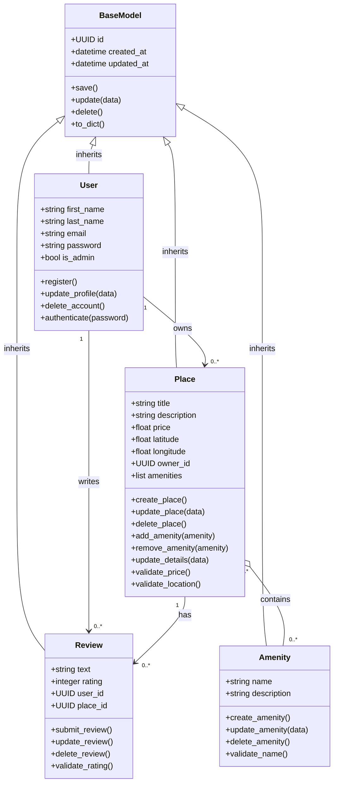
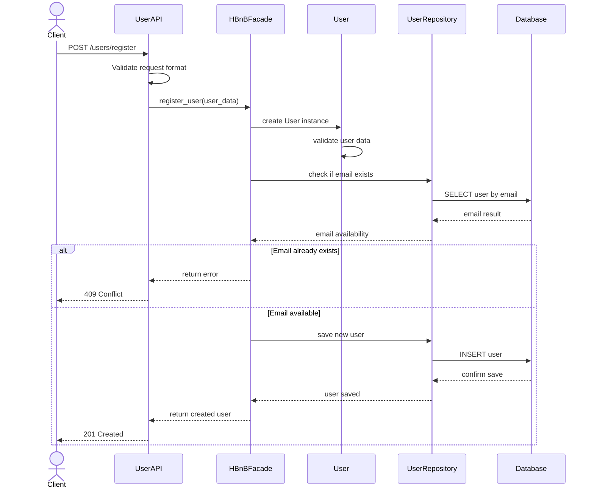
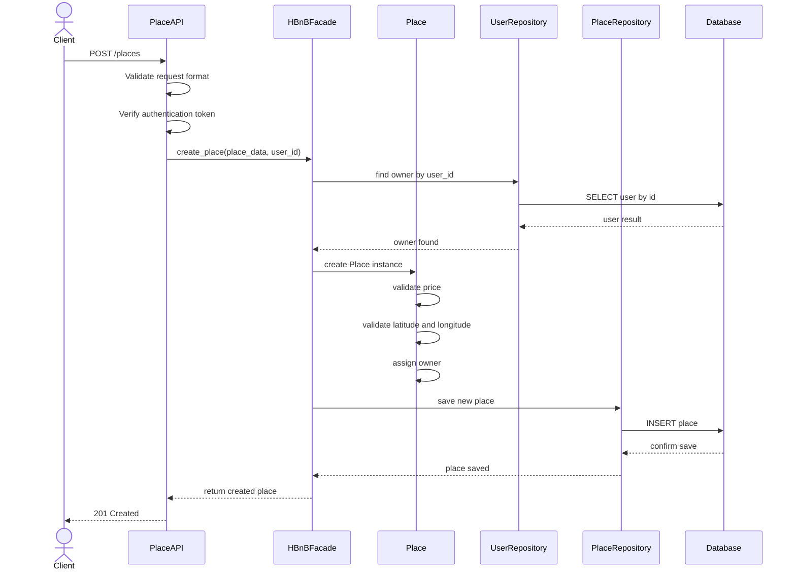
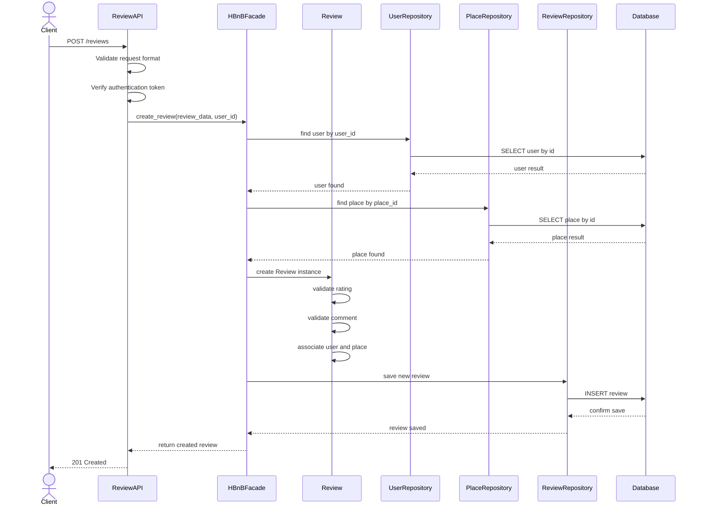
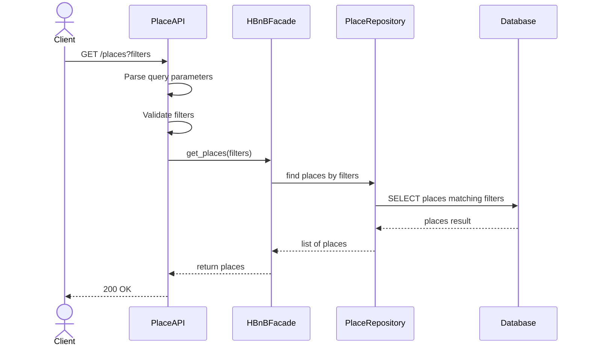

# HBnB Evolution — Technical Documentation
### Part 1 — Architecture & Design

---

## Table of Contents

1. [Introduction](#1-introduction)
2. [High-Level Architecture](#2-high-level-architecture)
3. [Business Logic Layer](#3-business-logic-layer)
4. [API Interaction Flow](#4-api-interaction-flow)
5. [Conclusion](#5-conclusion)

---

## 1. Introduction

### 1.1 Project Overview

HBnB Evolution is a web application inspired by AirBnB. It allows users to register accounts, create and manage property listings (places), browse available places, add amenities, and submit reviews. The system is designed with a clean layered architecture that separates concerns across three distinct layers, making the codebase maintainable, testable, and scalable.

### 1.2 Purpose of This Document

This technical document serves as the architectural blueprint for the HBnB Evolution project. It compiles all design diagrams and explanatory notes produced during Part 1 of the project into a single reference document.

The document covers:

- The high-level three-layer architecture and how the Facade pattern connects the layers
- The detailed class structure of the Business Logic Layer, including all entities, attributes, methods, and relationships
- The sequence of interactions for four key API calls, showing how requests flow through the system

This document will be used as a reference throughout the implementation phases of the project. Accuracy and completeness are critical.

### 1.3 Scope

This document covers the design and architecture of Part 1 of the HBnB Evolution project. It does not cover implementation details, deployment configuration, or security considerations beyond what is represented in the diagrams.

---

## 2. High-Level Architecture

### 2.1 Overview

The HBnB application is structured around a **three-layer architecture**, where each layer has a distinct responsibility. Communication between layers is mediated exclusively through the **Facade pattern**, keeping the layers decoupled and independently maintainable.

### 2.2 Package Diagram

> Source: `diagrams/0.package_diagram.mermaid`



### 2.3 Layer Descriptions

#### Presentation Layer

Handles all interaction between the client and the application. It exposes REST API endpoints for each core resource:

- `UserAPI` — handles user-related requests (registration, profile management)
- `PlaceAPI` — handles place listing requests
- `ReviewAPI` — handles review submission and retrieval
- `AmenityAPI` — handles amenity management

This layer never communicates directly with the Business Logic or Persistence layers. Every request is forwarded through the Facade.

#### HBnBFacade

The `HBnBFacade` is the single entry point between the Presentation Layer and the rest of the application. It implements the **Facade design pattern**, providing a unified interface that hides the complexity of the underlying layers.

It exposes the following operations:

- **User:** `create_user()`, `get_user()`, `delete_user()`
- **Place:** `create_place()`, `get_place()`, `delete_place()`
- **Review:** `create_review()`, `get_review()`, `delete_review()`
- **Amenity:** `create_amenity()`, `get_amenity()`, `delete_amenity()`

By centralizing communication through the Facade, the Presentation Layer remains unaware of how business logic is applied or how data is stored.

#### Business Logic Layer

Contains the service classes that implement the core business rules for each entity:

- `UserService` — handles user-related business logic
- `PlaceService` — handles place-related business logic
- `ReviewService` — handles review-related business logic
- `AmenityService` — handles amenity-related business logic

This layer receives instructions from the Facade and applies the appropriate business operations before delegating data persistence to the Persistence Layer.

#### Persistence Layer

Handles all data storage and retrieval. It provides a repository for each entity and manages the database connection:

- `UserRepository` — stores and retrieves user records
- `PlaceRepository` — stores and retrieves place records
- `ReviewRepository` — stores and retrieves review records
- `AmenityRepository` — stores and retrieves amenity records
- `DatabaseConnection` — manages the connection to the underlying database

### 2.4 Communication Flow

```text
Client Request
     |
     v
Presentation Layer  (UserAPI, PlaceAPI, ReviewAPI, AmenityAPI)
     |  uses (Facade Pattern)
     v
HBnBFacade
     |  manages business operations
     v
Business Logic Layer  (UserService, PlaceService, ReviewService, AmenityService)
     |  Database operations (stores / retrieves data)
     v
Persistence Layer  (UserRepository, PlaceRepository, ReviewRepository,
                    AmenityRepository, DatabaseConnection)
```

---

## 3. Business Logic Layer

### 3.1 Overview

This section presents the detailed class structure of the Business Logic Layer. It includes all key entities, their attributes, methods, and the relationships between them. All entities inherit from a common `BaseModel` class that provides shared identity and lifecycle fields.

### 3.2 Class Diagram

> Source: `diagrams/1.class_diagram.mermaid`



### 3.3 Class Descriptions

#### BaseModel

The parent class inherited by all entities in the system. It provides common attributes and methods shared across every model.

| Field | Type | Description |
|---|---|---|
| `id` | UUID | Unique identifier for every object |
| `created_at` | datetime | Timestamp of when the object was created |
| `updated_at` | datetime | Timestamp of the last update |

Methods: `save()`, `update(data)`, `delete()`, `to_dict()`

---

#### User

Represents a registered user of the application. Inherits from `BaseModel`.

| Field | Type | Description |
|---|---|---|
| `first_name` | string | User's first name |
| `last_name` | string | User's last name |
| `email` | string | Email address used for login |
| `password` | string | Hashed password |
| `is_admin` | bool | Whether the user has admin privileges |

Methods: `register()`, `update_profile(data)`, `delete_account()`, `authenticate(password)`

---

#### Place

Represents a property listing created by a user. Inherits from `BaseModel`.

| Field | Type | Description |
|---|---|---|
| `title` | string | Name of the place |
| `description` | string | Detailed description |
| `price` | float | Price per night |
| `latitude` | float | Geographic latitude |
| `longitude` | float | Geographic longitude |
| `owner_id` | UUID | Reference to the User who owns the place |
| `amenities` | list | List of associated Amenity objects |

Methods: `create_place()`, `update_place(data)`, `delete_place()`, `add_amenity(amenity)`, `remove_amenity(amenity)`, `validate_price()`, `validate_location()`

---

#### Review

Represents a review submitted by a user for a place. Inherits from `BaseModel`.

| Field | Type | Description |
|---|---|---|
| `text` | string | Written content of the review |
| `rating` | integer | Numeric rating given to the place |
| `user_id` | UUID | Reference to the User who wrote the review |
| `place_id` | UUID | Reference to the Place being reviewed |

Methods: `submit_review()`, `update_review()`, `delete_review()`, `validate_rating()`

---

#### Amenity

Represents a feature or facility that can be associated with a place. Inherits from `BaseModel`.

| Field | Type | Description |
|---|---|---|
| `name` | string | Name of the amenity (e.g. WiFi, Pool) |
| `description` | string | Brief description of the amenity |

Methods: `create_amenity()`, `update_amenity(data)`, `delete_amenity()`, `validate_name()`

---

### 3.4 Relationships

| Relationship | Type | Description |
|---|---|---|
| `BaseModel <\|-- User` | Inheritance | User inherits all base attributes and methods |
| `BaseModel <\|-- Place` | Inheritance | Place inherits all base attributes and methods |
| `BaseModel <\|-- Review` | Inheritance | Review inherits all base attributes and methods |
| `BaseModel <\|-- Amenity` | Inheritance | Amenity inherits all base attributes and methods |
| `User "1" --> "0..*" Place` | Association | A user can own zero or more places |
| `User "1" --> "0..*" Review` | Association | A user can write zero or more reviews |
| `Place "1" --> "0..*" Review` | Association | A place can have zero or more reviews |
| `Place "0..*" o-- "0..*" Amenity` | Aggregation | Places and amenities share a many-to-many relationship |

---

## 4. API Interaction Flow

### 4.1 Overview

This section presents sequence diagrams for four key API calls in the HBnB Evolution application. Each diagram illustrates how a client request travels through the Presentation Layer, the HBnBFacade, the Business Logic Layer, and the Persistence Layer before returning a response.

The general flow for all API calls is:

```text
Client
  -> Presentation Layer  (validates request)
  -> HBnBFacade          (coordinates the operation)
  -> Business Model      (applies business logic)
  -> Persistence Layer   (stores / retrieves data)
  -> Response back to Client
```

---

### 4.2 User Registration

A new user submits their details to create an account. The API validates the input, the Facade coordinates the creation of the user, and the Persistence Layer stores the new record. If the email already exists, a conflict error is returned.

> Source: `diagrams/2.sequence_diagrams.md — Section 1`



**Flow explanation:**

1. The client sends a POST request with registration data to `UserAPI`.
2. `UserAPI` validates the request format.
3. The request is forwarded to `HBnBFacade` via `register_user()`.
4. The Facade creates a `User` instance and applies business validation.
5. The Persistence Layer checks whether the email already exists.
6. If the email is taken, a 409 Conflict response is returned.
7. If available, the new user is saved and a 201 Created response is returned.

---

### 4.3 Place Creation

An authenticated user submits details for a new place listing. The Facade verifies the owner exists, validates the place data, and stores the listing through the Persistence Layer.

> Source: `diagrams/2.sequence_diagrams.md — Section 2`



**Flow explanation:**

1. The client sends a POST request with place data to `PlaceAPI`.
2. `PlaceAPI` validates the request and verifies the authentication token.
3. The Facade retrieves the owner using `UserRepository`.
4. A `Place` instance is created and its price and location are validated.
5. The place is saved using `PlaceRepository` and a 201 Created response is returned.

---

### 4.4 Review Submission

An authenticated user submits a review for a place. The Facade verifies both the user and place exist, creates and validates the review, and stores it in the Persistence Layer.

> Source: `diagrams/2.sequence_diagrams.md — Section 3`



**Flow explanation:**

1. The client sends a POST request with review data to `ReviewAPI`.
2. `ReviewAPI` validates the request and verifies authentication.
3. The Facade retrieves the user and verifies the place being reviewed.
4. A `Review` instance is created; rating and comment are validated.
5. The review is associated with the user and place, then saved.
6. A 201 Created response is returned to the client.

---

### 4.5 Fetching a List of Places

A user requests a filtered list of places. The API parses and validates the query parameters, the Facade delegates to `PlaceRepository`, which queries the database and returns the matching results.

> Source: `diagrams/2.sequence_diagrams.md — Section 4`



**Flow explanation:**

1. The client sends a GET request with optional query filters to `PlaceAPI`.
2. `PlaceAPI` parses and validates the query parameters.
3. The Facade delegates to `PlaceRepository` with the filter criteria.
4. `PlaceRepository` queries the database and returns matching records.
5. The list of places is returned to the client with a 200 OK response.

---

## 5. Conclusion

This document provides a comprehensive technical overview of the HBnB Evolution application architecture as designed in Part 1 of the project.

The three-layer architecture — Presentation, Business Logic, and Persistence — ensures clear separation of concerns. The `HBnBFacade` acts as the central interface between layers, decoupling the API from the internal models and persistence logic. This design makes each layer independently testable and allows the storage backend to be swapped without affecting any other part of the system.

The diagrams and notes in this document cover:

- The high-level package structure and communication pathways via the Facade pattern
- The detailed class hierarchy of the Business Logic Layer with all attributes, methods, and relationships
- The step-by-step interaction flow for User Registration, Place Creation, Review Submission, and Fetching a List of Places

This document will serve as the primary architectural reference during the implementation phases of the HBnB Evolution project.
